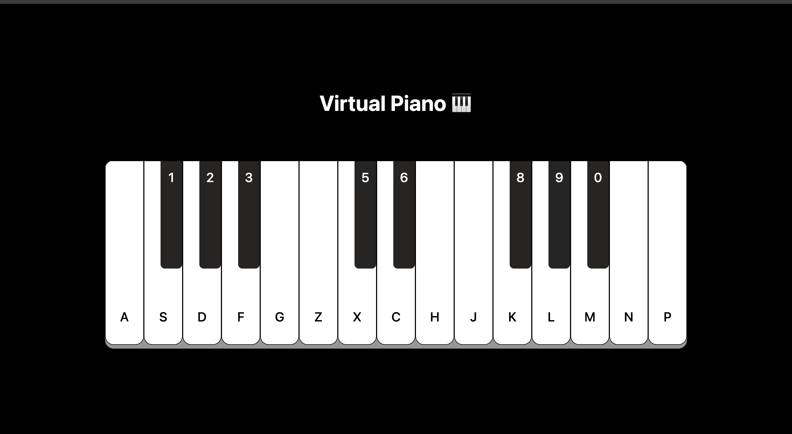

## 🎹 Virtual Piano

A fully interactive virtual piano built using HTML, CSS, and JavaScript.  
Supports keyboard keys, mouse clicks, and mobile touch, including both white & black keys with unique sounds.  
Smooth key-press animations and zero-lag response create a realistic piano feel.

---

## 🌐 Live Demo
https://dev-hamza03.github.io/virtual-piano/

## 📁 GitHub Repository
https://github.com/dev-hamza03/virtual-piano

---

## 🖼️ Screenshot



---

## ✨ Features
- 23 unique piano sounds
- Keyboard key support
- Mouse click support
- Mobile touch support
- Working black + white keys
- Smooth opacity press animation
- Fast sound response (no delay)
- Black key does not trigger white key
- Clean UI with SCSS styling

---

## 🎼 Key Mapping

White Keys:
A, S, D, F, G, Z, X, C, H, J, K, L, M, N, P

Black Keys (Numbers):
1, 2, 3, 5, 6, 8, 9, 0

---

## 🛠 Technologies Used
HTML5  
CSS3 / SCSS  
JavaScript (Vanilla)  
Audio API

---

## 📱 Mobile Support
Touch-friendly  
Fast response  
Smooth feedback animation  
Fully functional black + white keys

---

## 📂 Project Structure

```
virtual-piano  
├── index.html  
├── style.css / style.scss  
├── script.js  
└── assets
    ├── images
    └── sounds
```

---

## 🚀 Installation (Clone This Project)

```
git clone https://github.com/dev-hamza03/virtual-piano
```

Then open index.html in your browser.

---

## 🚀 How to Play
1. Open the live demo  
2. Press keyboard keys (A, S, D, F...)  
3. Or click/tap on piano keys  
4. Enjoy making music 🎶

---

## 🔮 Future Improvements
- Sustain (long press) support  
- Record & playback  
- Volume slider  
- Auto-play demo songs  
- Glow animation  

---

## ⭐ Support
If you like this project, please star the repository ⭐  
Your support motivates me to build more awesome projects!

---

## 📜 License
This project is open-source and free to use.
